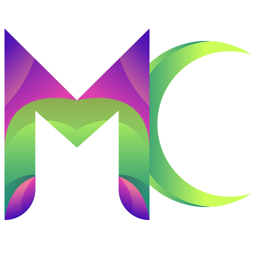

  

# Monster Clicker 

## Introduction

Monster Clicker is a classic and simple Clicker Game. 
Your main goal is to finish the 4 stages quickly as possible.  
Your finish time will be recorded on the Leaderboard. Invite and try to beat your friends. 

The game consists of 4 stages each with 10 monster. 
There are 4 upgrades that you can buy to finish the game quicker: 
DPC -- Damage Per Click 
DPS -- Damage Per Second 
Extra Click -- Click Count 
Extra Money -- %10 more money per monster 

You can also watch a Rewarded before the game to get a bonus upgrade.

## Screenshots
<table align="center">
<tr>
<td>

</td>

<td>

</td>
</tr>
<td>

</td>
 <td>

 </td>
  </tr>
</tr>
</tr>
</table>

## Used Assets
**Note:** This repository doesn't include the assets those I don't hold the right to distrubute. 
You have to acquire the assets to properly run the game in Unity.

GUI PRO Kit - Fantasy RPG : https://assetstore.unity.com/packages/2d/gui/gui-pro-kit-fantasy-rpg-170168

GUI Parts: https://assetstore.unity.com/packages/2d/gui/icons/gui-parts-159068

Player and enemy characters by –Ækashics ヾ(o✪‿✪o)ｼ : http://www.akashics.moe/

Free Pixel Font - Thaleah : https://assetstore.unity.com/packages/2d/fonts/free-pixel-font-thaleah-140059

Logo attribution: <a href="https://www.freepik.com/vectors/logo">Logo vector created by freepik - www.freepik.com</a>
